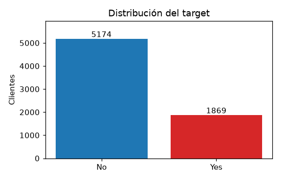
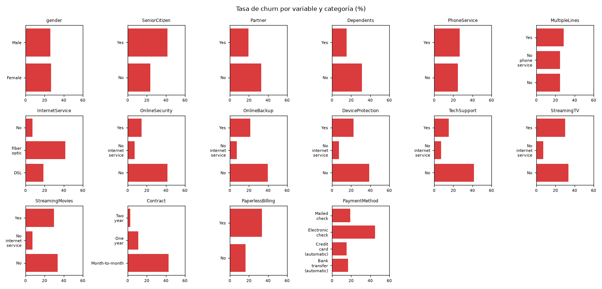
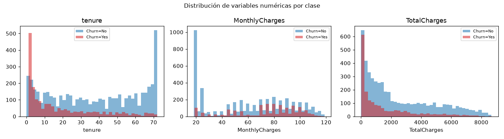
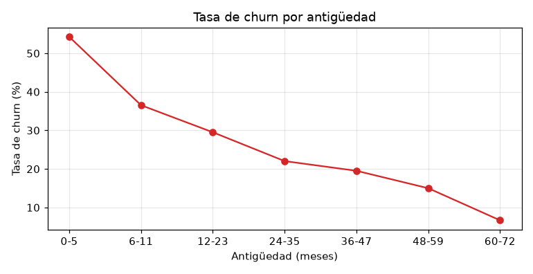

# EDA del dataset procesado (T-09)

Informe generado automáticamente. Fuente: `data\processed\churn_cleaned.csv` (checksum `5a75bec3a2eeb24b74b55baa14d7035d37aab769bc205013ff1daf69bad451d2`).
- Tamaño: 7043 filas × 21 columnas.
- Semilla fija del proyecto: `42`.
- Reproducción: `python -m src.analysis.eda`.

## 1. Desbalanceo del target

| Clase | n | % | Clase de interés |
|---|---|---|---|
| No | 5174 | 73.46 | No |
| Yes | 1869 | 26.54 | **Sí** |

- Ratio no-churn / churn: **2.77:1**.
- Clase positiva (interés): **Churn == 'Yes'**.

## 2. Valores faltantes

| Campo | Ausencias |
|---|---|
| customerID | 0 |
| gender | 0 |
| SeniorCitizen | 0 |
| Partner | 0 |
| Dependents | 0 |
| tenure | 0 |
| PhoneService | 0 |
| MultipleLines | 0 |
| InternetService | 0 |
| OnlineSecurity | 0 |
| OnlineBackup | 0 |
| DeviceProtection | 0 |
| TechSupport | 0 |
| StreamingTV | 0 |
| StreamingMovies | 0 |
| Contract | 0 |
| PaperlessBilling | 0 |
| PaymentMethod | 0 |
| MonthlyCharges | 0 |
| TotalCharges | 0 |
| Churn | 0 |

El dataset procesado no presenta valores faltantes. El raw sí tenía 11 ausencias estructurales en `TotalCharges` (todas con `tenure == 0` y `Churn == 'No'`), tratadas por imputación con 0 en `T-08` (`docs/missing_values.md`). La ausencia en el raw era determinística, no aleatoria, y estaba asociada a clientes nuevos.

## 3. Perfil univariado

### 3.1 Variables categóricas

| Variable | Categoría | n | % |
|---|---|---|---|
| gender | Male | 3555 | 50.48 |
| gender | Female | 3488 | 49.52 |
|---|---|---|---|
| SeniorCitizen | No | 5901 | 83.79 |
| SeniorCitizen | Yes | 1142 | 16.21 |
|---|---|---|---|
| Partner | No | 3641 | 51.70 |
| Partner | Yes | 3402 | 48.30 |
|---|---|---|---|
| Dependents | No | 4933 | 70.04 |
| Dependents | Yes | 2110 | 29.96 |
|---|---|---|---|
| PhoneService | Yes | 6361 | 90.32 |
| PhoneService | No | 682 | 9.68 |
|---|---|---|---|
| MultipleLines | No | 3390 | 48.13 |
| MultipleLines | Yes | 2971 | 42.18 |
| MultipleLines | No phone service | 682 | 9.68 |
|---|---|---|---|
| InternetService | Fiber optic | 3096 | 43.96 |
| InternetService | DSL | 2421 | 34.37 |
| InternetService | No | 1526 | 21.67 |
|---|---|---|---|
| OnlineSecurity | No | 3498 | 49.67 |
| OnlineSecurity | Yes | 2019 | 28.67 |
| OnlineSecurity | No internet service | 1526 | 21.67 |
|---|---|---|---|
| OnlineBackup | No | 3088 | 43.84 |
| OnlineBackup | Yes | 2429 | 34.49 |
| OnlineBackup | No internet service | 1526 | 21.67 |
|---|---|---|---|
| DeviceProtection | No | 3095 | 43.94 |
| DeviceProtection | Yes | 2422 | 34.39 |
| DeviceProtection | No internet service | 1526 | 21.67 |
|---|---|---|---|
| TechSupport | No | 3473 | 49.31 |
| TechSupport | Yes | 2044 | 29.02 |
| TechSupport | No internet service | 1526 | 21.67 |
|---|---|---|---|
| StreamingTV | No | 2810 | 39.90 |
| StreamingTV | Yes | 2707 | 38.44 |
| StreamingTV | No internet service | 1526 | 21.67 |
|---|---|---|---|
| StreamingMovies | No | 2785 | 39.54 |
| StreamingMovies | Yes | 2732 | 38.79 |
| StreamingMovies | No internet service | 1526 | 21.67 |
|---|---|---|---|
| Contract | Month-to-month | 3875 | 55.02 |
| Contract | Two year | 1695 | 24.07 |
| Contract | One year | 1473 | 20.91 |
|---|---|---|---|
| PaperlessBilling | Yes | 4171 | 59.22 |
| PaperlessBilling | No | 2872 | 40.78 |
|---|---|---|---|
| PaymentMethod | Electronic check | 2365 | 33.58 |
| PaymentMethod | Mailed check | 1612 | 22.89 |
| PaymentMethod | Bank transfer (automatic) | 1544 | 21.92 |
| PaymentMethod | Credit card (automatic) | 1522 | 21.61 |
|---|---|---|---|

### 3.2 Variables numéricas

| Variable | n | media | std | min | p25 | p50 | p75 | max | atípicos(IQR) |
|---|---|---|---|---|---|---|---|---|---|
| tenure | 7043 | 32.37 | 24.56 | 0.00 | 9.00 | 29.00 | 55.00 | 72.00 | 0 |
| MonthlyCharges | 7043 | 64.76 | 30.09 | 18.25 | 35.50 | 70.35 | 89.85 | 118.75 | 0 |
| TotalCharges | 7043 | 2279.73 | 2266.79 | 0.00 | 398.55 | 1394.55 | 3786.60 | 8684.80 | 0 |

## 4. Perfil bivariado

## 4.1 Variables categóricas vs target

| Variable | Categoría | n | churn (n) | tasa de churn |
|---|---|---|---|---|
| gender | Female | 3488 | 939 | 26.92 % |
| gender | Male | 3555 | 930 | 26.16 % |
| SeniorCitizen | No | 5901 | 1393 | 23.61 % |
| SeniorCitizen | Yes | 1142 | 476 | 41.68 % |
| Partner | No | 3641 | 1200 | 32.96 % |
| Partner | Yes | 3402 | 669 | 19.66 % |
| Dependents | No | 4933 | 1543 | 31.28 % |
| Dependents | Yes | 2110 | 326 | 15.45 % |
| PhoneService | No | 682 | 170 | 24.93 % |
| PhoneService | Yes | 6361 | 1699 | 26.71 % |
| MultipleLines | No | 3390 | 849 | 25.04 % |
| MultipleLines | No phone service | 682 | 170 | 24.93 % |
| MultipleLines | Yes | 2971 | 850 | 28.61 % |
| InternetService | DSL | 2421 | 459 | 18.96 % |
| InternetService | Fiber optic | 3096 | 1297 | 41.89 % |
| InternetService | No | 1526 | 113 | 7.40 % |
| OnlineSecurity | No | 3498 | 1461 | 41.77 % |
| OnlineSecurity | No internet service | 1526 | 113 | 7.40 % |
| OnlineSecurity | Yes | 2019 | 295 | 14.61 % |
| OnlineBackup | No | 3088 | 1233 | 39.93 % |
| OnlineBackup | No internet service | 1526 | 113 | 7.40 % |
| OnlineBackup | Yes | 2429 | 523 | 21.53 % |
| DeviceProtection | No | 3095 | 1211 | 39.13 % |
| DeviceProtection | No internet service | 1526 | 113 | 7.40 % |
| DeviceProtection | Yes | 2422 | 545 | 22.50 % |
| TechSupport | No | 3473 | 1446 | 41.64 % |
| TechSupport | No internet service | 1526 | 113 | 7.40 % |
| TechSupport | Yes | 2044 | 310 | 15.17 % |
| StreamingTV | No | 2810 | 942 | 33.52 % |
| StreamingTV | No internet service | 1526 | 113 | 7.40 % |
| StreamingTV | Yes | 2707 | 814 | 30.07 % |
| StreamingMovies | No | 2785 | 938 | 33.68 % |
| StreamingMovies | No internet service | 1526 | 113 | 7.40 % |
| StreamingMovies | Yes | 2732 | 818 | 29.94 % |
| Contract | Month-to-month | 3875 | 1655 | 42.71 % |
| Contract | One year | 1473 | 166 | 11.27 % |
| Contract | Two year | 1695 | 48 | 2.83 % |
| PaperlessBilling | No | 2872 | 469 | 16.33 % |
| PaperlessBilling | Yes | 4171 | 1400 | 33.57 % |
| PaymentMethod | Bank transfer (automatic) | 1544 | 258 | 16.71 % |
| PaymentMethod | Credit card (automatic) | 1522 | 232 | 15.24 % |
| PaymentMethod | Electronic check | 2365 | 1071 | 45.29 % |
| PaymentMethod | Mailed check | 1612 | 308 | 19.11 % |

## 4.2 Variables numéricas vs target

### Correlación punto-biserial con el target

| Variable | r |
|---|---|
| tenure | -0.352 |
| MonthlyCharges | 0.193 |
| TotalCharges | -0.198 |

### Tasa de churn por tramos

#### tenure

| Tramos | n | tasa de churn |
|---:|---:|---:|
| (-0.001, 3.0] | 1062 | 56.21 % |
| (18.0, 29.0] | 835 | 23.35 % |
| (29.0, 42.0] | 852 | 21.71 % |
| (3.0, 9.0] | 792 | 41.16 % |
| (42.0, 55.0] | 867 | 16.03 % |
| (55.0, 67.0] | 909 | 10.56 % |
| (67.0, 72.0] | 846 | 4.73 % |
| (9.0, 18.0] | 880 | 33.07 % |

#### MonthlyCharges

| Tramos | n | tasa de churn |
|---:|---:|---:|
| (100.2, 118.75] | 874 | 27.46 % |
| (18.249, 20.3] | 896 | 9.15 % |
| (20.3, 35.5] | 866 | 13.39 % |
| (35.5, 55.15] | 885 | 28.02 % |
| (55.15, 70.35] | 881 | 21.11 % |
| (70.35, 80.2] | 879 | 38.91 % |
| (80.2, 89.85] | 878 | 36.10 % |
| (89.85, 100.2] | 884 | 38.24 % |

#### TotalCharges

| Tramos | n | tasa de churn |
|---:|---:|---:|
| (-0.001, 116.112] | 881 | 51.42 % |
| (116.112, 398.55] | 881 | 35.07 % |
| (1394.55, 2290.225] | 880 | 21.14 % |
| (2290.225, 3786.6] | 880 | 24.89 % |
| (3786.6, 5606.375] | 880 | 16.02 % |
| (398.55, 838.362] | 879 | 27.19 % |
| (5606.375, 8684.8] | 881 | 12.94 % |
| (838.362, 1394.55] | 881 | 23.61 % |

## 5. Hallazgos y decisiones

| Hallazgo | Evidencia | Decisión para fases siguientes (T-10/T-11/T-12) |
|---|---|---|
| **F1** | Desbalanceo del target: churn 26.54 %. | Evaluación con métricas sobre la clase minoritaria (recall, precisión, F1, AUC-PR); no usar accuracy como criterio. |
| **F2** | Churn muy alto en clientes nuevos (tenure <= 3 meses: 56.21 %) y bajo en antiguos (tenure >= 60: 6.68 %). | `tenure` es feature central; considerar bins de antigüedad. |
| **F3** | Contrato: Month-to-month 42.71 %, One year 11.27 %, Two year 2.83 %. | Feature fuerte; candidata a interacción contract × tenure. |
| **F4** | PaymentMethod: Electronic check 45.29 % vs automáticos/listados (19.11 % o menos). | Feature candidata; evaluar agrupación de métodos de pago. |
| **F5** | InternetService: Fiber optic 41.89 %, DSL 18.96 %, No 7.40 %. | Feature candidata; mantener la distinción DSL vs Fiber optic. |
| **F6** | Servicios de valor añadido ausentes (OnlineSecurity, TechSupport, etc.) se asocian a mayor churn. | Features indicadoras de adopción; evaluar interacciones con InternetService. |
| **F7** | SeniorCitizen: churn 41.68 % (seniors) vs 23.61 %. | Feature incluida; representación categórica binaria. |
| **F8** | MonthlyCharges correlaciona positivamente con churn, pero está confundida con tenure y tipo de contrato. | Evaluar en modelos condicionando por tenure/contract; estandarizar. |
| **F9** | Alta correlación entre variables numéricas: tenure–TotalCharges r = 0.83, MonthlyCharges–TotalCharges r = 0.65. | Riesgo de multicolinealidad; considerar reducir o derivar variables (p. ej. cargo medio histórico). |
